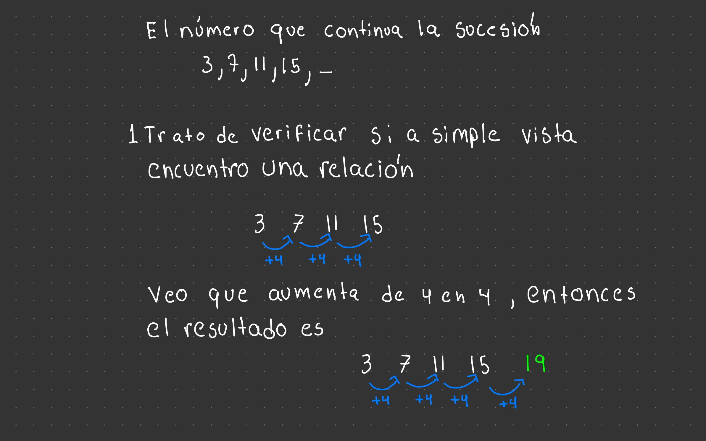

# Razonamiento Matemático

## Sucesiones Numéricas

Es un serie de números que cumplen una formula matematica,la cual esta creado por la combinación de operaciones

Lo primero que trato de hacer es ver si existe una relación entre los numero a simple vista.

